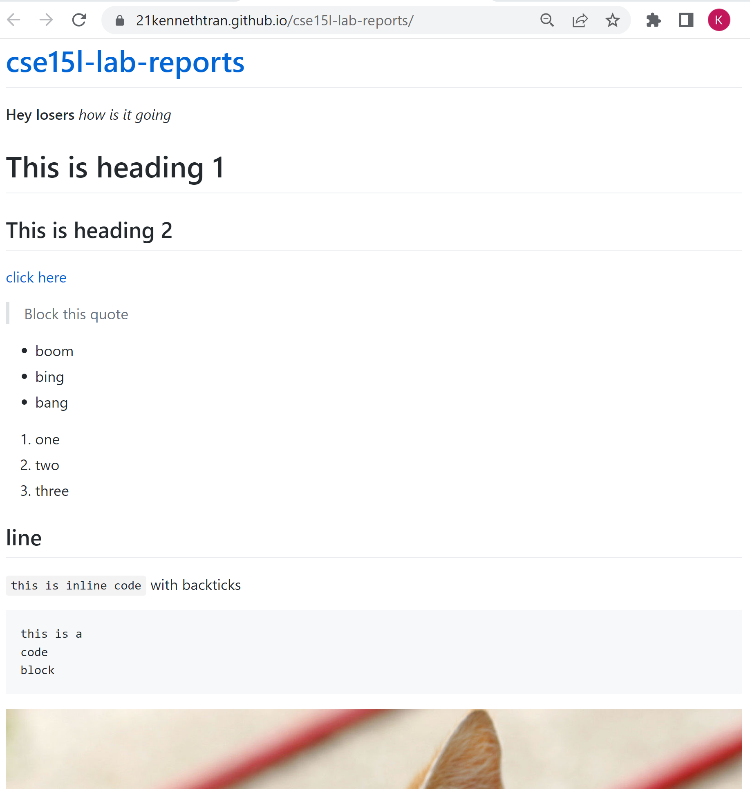

# Week 2 Lab Report

## 1. Installing VScode
boobooblah

## 2. Remotely Connecting

## 3. Trying some Commands

## 4. Moving Files with `scp`

## 5. Getting an SSH Key

## 6. Optimizing Remote Running

