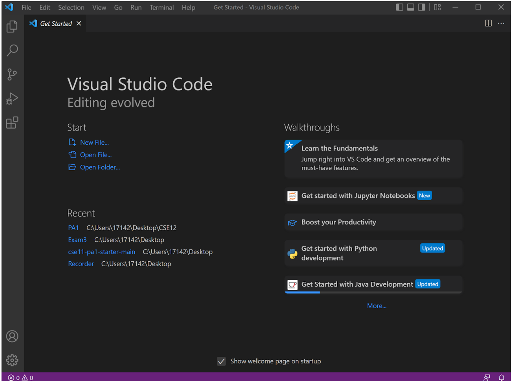
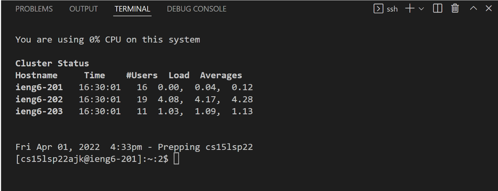
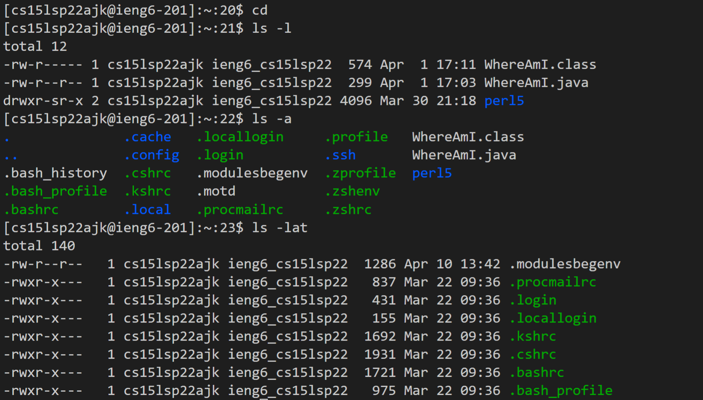
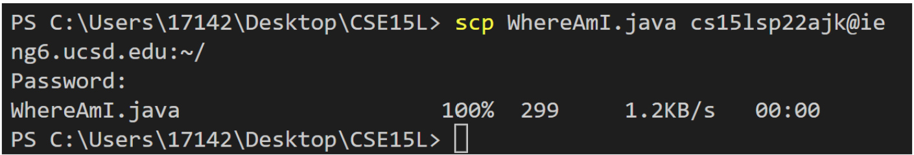
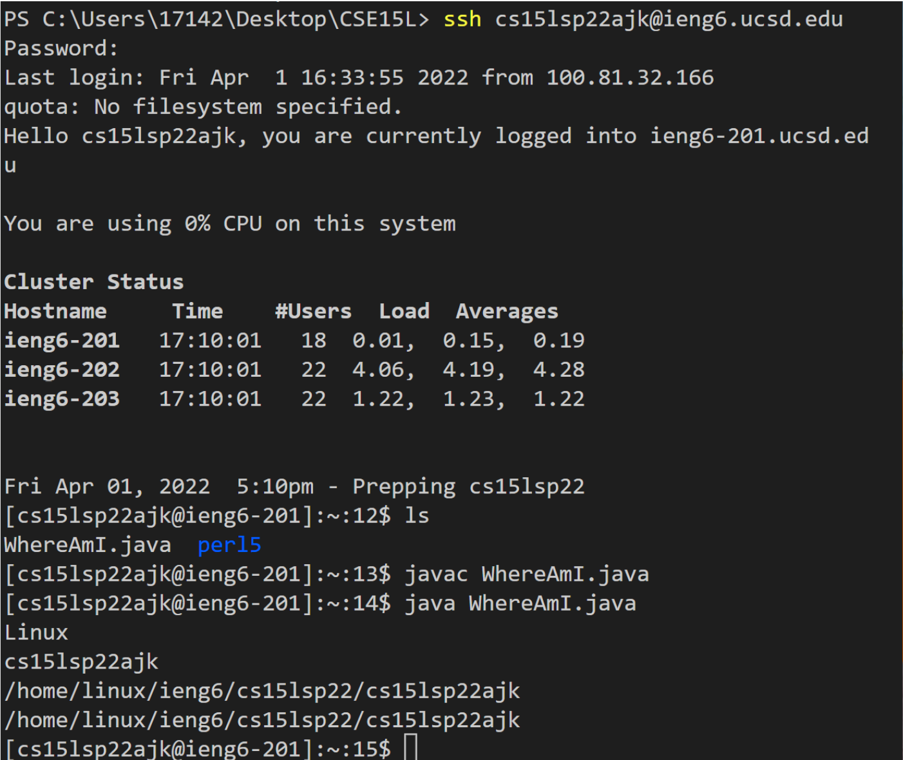
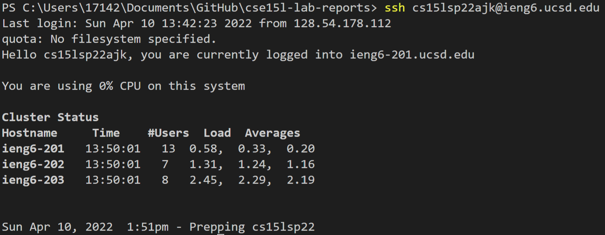
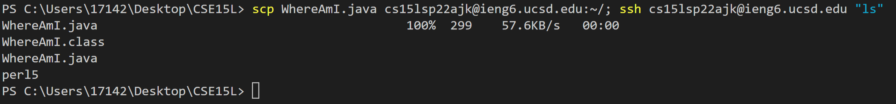

# Week 2 Lab Report

## 1. Installing VScode

We would first need to install the correct [Visual Studio Code](https://code.visualstudio.com/) for our computer. In my case, I am on a Windows laptop, so I followed to steps for installing VS Code on a Windows device from their website. After opening Visual Studio Code, we should get a window like the screenshot above.

## 2. Remotely Connecting

On VS Code, I opened up a new terminal by navigating through *terminal --> new terminal* at the top of the window. Before remotely connecting, I made sure to have installed [OpenSSH](https://docs.microsoft.com/en-us/windows-server/administration/openssh/openssh_install_firstuse) for Windows, as well as to make sure I know my [remote account](https://sdacs.ucsd.edu/~icc/index.php). The last step would be to run `ssh cs15lsp22ajk@ieng6.ucsd.edu` where the **ajk** specifies my given account.

## 3. Trying some Commands

Now that I am remotely connected to this account, I can run several commands to look at what files the account currently has. Some of the ones I have tried in my screenshot are: `cd`, `ls -l`, `ls -a`, `ls -lat`. I also learned that `l` prints out the files in **long format**, `a` prints out **all** files, `t` prints out the files in order **by time**, and that any combination of those key letters after `ls` outputs all of their information.

## 4. Moving Files with `scp`

After familiarizing myself with the remote computer, I used the `exit` command to go back to my computer. I created a file called `WhereAmI.java` and pasted some lines of code, namely the `.getProperty` method which would return information on the current system the file is in. Next, I ran `scp WhereAmI.java cs15lsp22ajk@ient6.ucsd.edu:~/` to copy that file over to my remote computer.

After running this file on my own computer, I logged onto the remote computer useing `ssh` and ran the copied file there. While the file on my own computer outputted information of where it was on my Windows laptop, the other file returned information on the Linux remote computer.

## 5. Getting an SSH Key

In order to speed up the process of logging onto the remote computer using `ssh` or `scp`, I had to generate a SSH key on my client terminal using `ssh key-gen`. I would then save the public key in the `id_rsa.pub` file, then copy that path to the remote computer using the `scp` command. By doing so without setting a password, I could now use `scp` and `ssh` without entering any password.

## 6. Optimizing Remote Running

Now that there are no passwords involved when using `scp` or `ssh`, I could run several commands in one line of the terminal to change something in the remote computer from my client. In my screenshot, I decided to add another copy of th `WhereAmI.java` file to the remote computer, and then list all the current files in the remote computer. I was able to separate different commands with a `;`, and stay on the client terminal after the command by using `"ls"`.