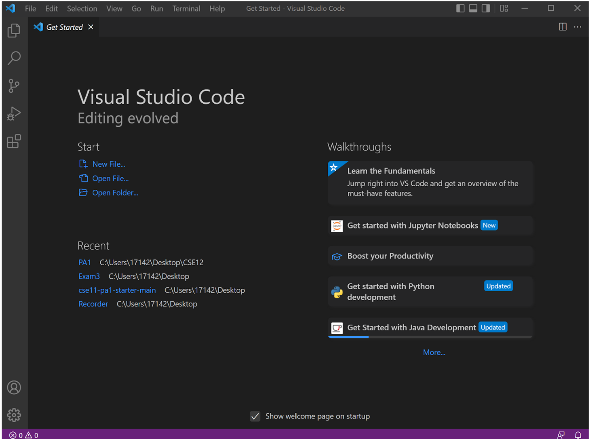
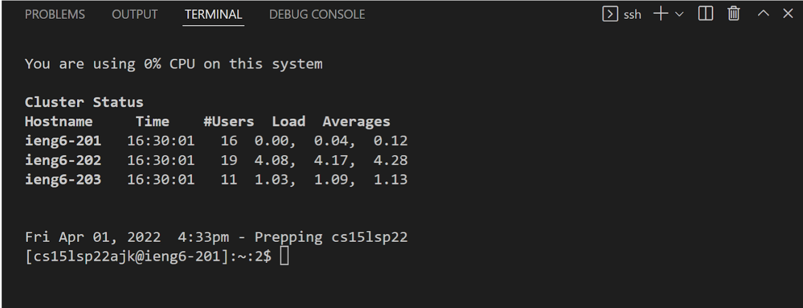
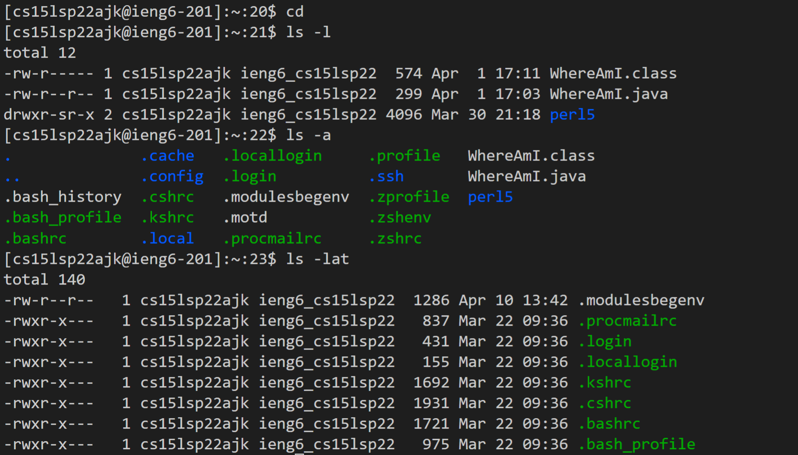
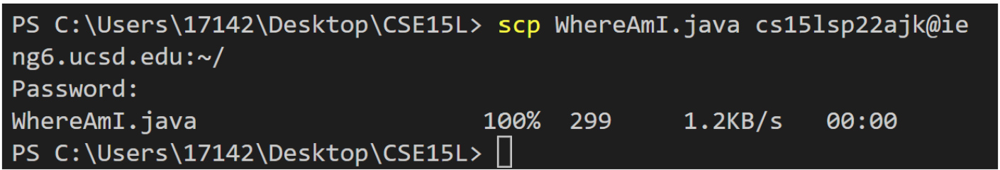
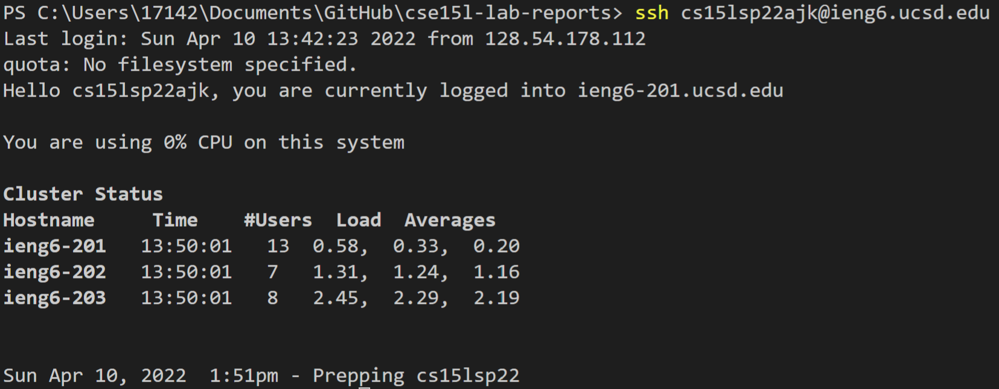
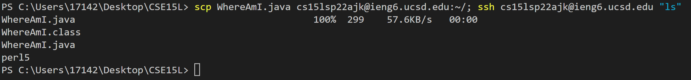

# Week 2 Lab Report

## 1. Installing VScode

We would first need to install the correct [Visual Studio Code](https://code.visualstudio.com/) for our computer. In my case, I am on a Windows laptop, so I followed to steps for installing VS Code on a Windows device from their website. After opening Visual Studio Code, we should get a window like the screenshot above.

## 2. Remotely Connecting

On VS Code, I opened up a new terminal by navigating through *terminal --> new terminal* at the top of the window. Before remotely connecting, I made sure to have installed [OpenSSH](https://docs.microsoft.com/en-us/windows-server/administration/openssh/openssh_install_firstuse) for Windows, as well as to make sure I know my [remote account](https://sdacs.ucsd.edu/~icc/index.php). The last step would be to run `ssh cs15lsp22ajk@ieng6.ucsd.edu` where the **ajk** specifies my given account.

## 3. Trying some Commands

Now that I am remotely connected to this account, I can run several commands to look at what files the account currently has. Some of the ones I have tried in my screenshot are: `cd`, `ls -l`, `ls -a`, `ls -lat`. I also learned that `l` prints out the files in **long format**, `a` prints out **all** files, `t` prints out the files in order **by time**, and that any combination of those key letters after `ls` outputs all of their information.

## 4. Moving Files with `scp`

## 5. Getting an SSH Key

## 6. Optimizing Remote Running

