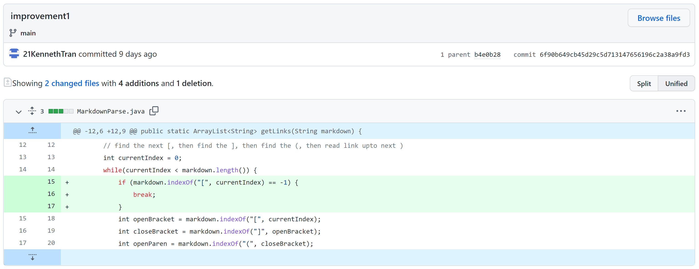
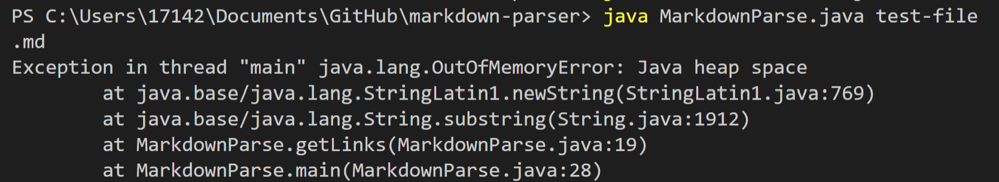
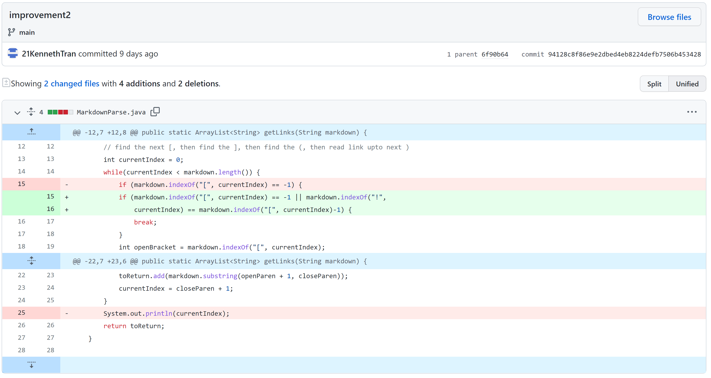
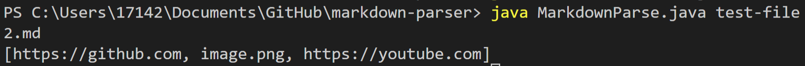
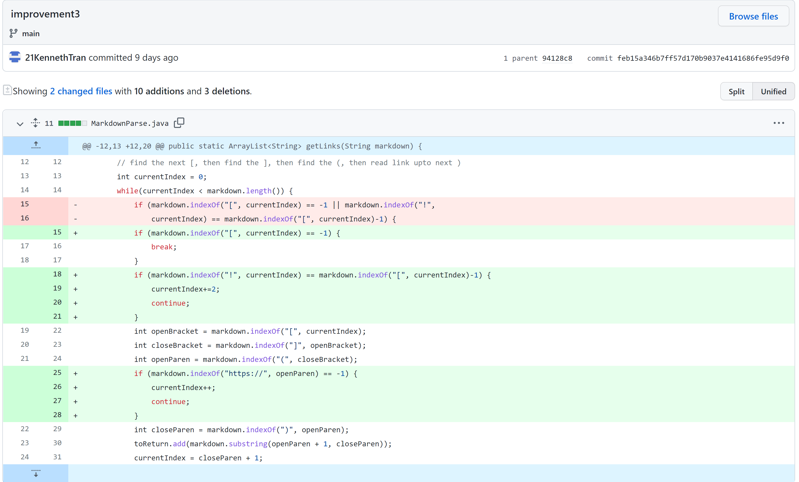
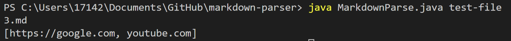

# Week 4 Lab Report

## 1. Markdown Parser Improvement 1

In the first step of fixing the Markdown Parser program, I attempted to fix the initial given failure-inducing input, [test-file.md](https://raw.githubusercontent.com/21KennethTran/markdown-parser/main/test-file.md), which is shown to have an extra line after `[link2](https://some-thing.com)`. The symptom that showed after running the file with the program was essentially an infinite loop, which caused the following output:

The bug was the fact that as long as there are characters after the last link, the program would continue to keep running without stopping. By adding the lines in the first screenshot, the program would stop if the first bracket was not found.

## 2. Markdown Parser Improvement 2

I decided to create another failure-inducing file, called [test-file2.md](https://raw.githubusercontent.com/21KennethTran/markdown-parser/main/test-file2.md). The logical bug I attempted to fix here was the fact that images are not technically links, and the way images and links are denoted in markdown is similar.

When comparing [test-file2.md](https://raw.githubusercontent.com/21KennethTran/markdown-parser/main/test-file2.md) with the result of the program, the symptom here is that `` should not be included as a link. Therefore, the improvement made in the first screenshot made sure that if **!** came right before the first **]**, then the program would find the next open bracket.

## 3. Markdown Parser Improvement 3

In the third development, I created the failure-inducing file, [test-file3.md](https://raw.githubusercontent.com/21KennethTran/markdown-parser/main/test-file3.md). This would test another logical bug, the idea that links should always start with **https://**.

When comparing the contents of [test-file3.md](https://raw.githubusercontent.com/21KennethTran/markdown-parser/main/test-file3.md) and the output of running the program, `[good](youtube.com)` should not be one of the links, and so *youtube.com* is an observable output symptom. So, with the newly added lines of code seen in the first screenshot, the program would search for **https://** after the first open paranthesis, thus fixing this initial bug.