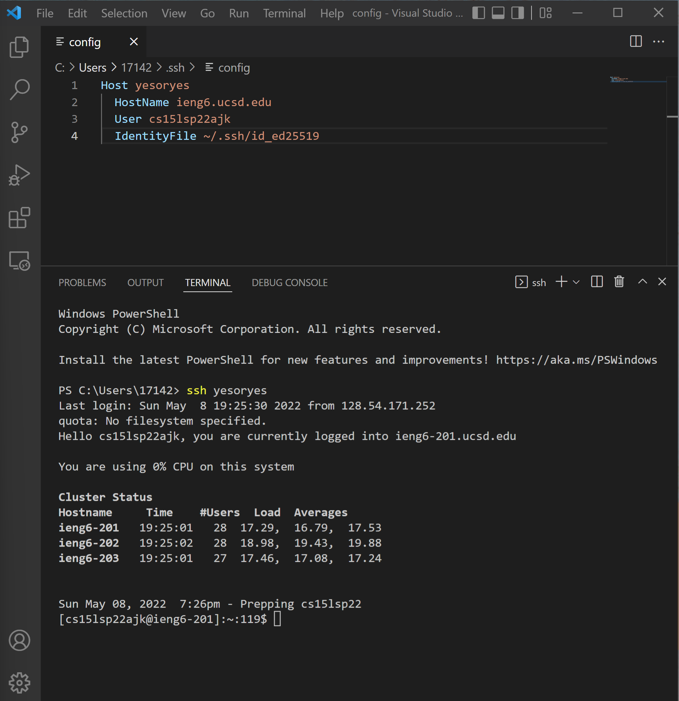
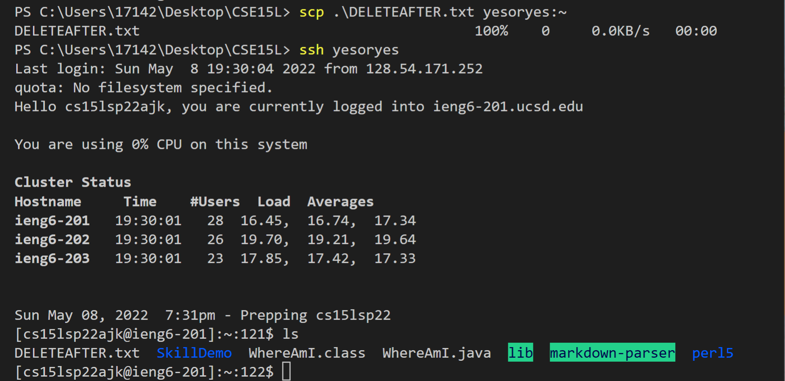
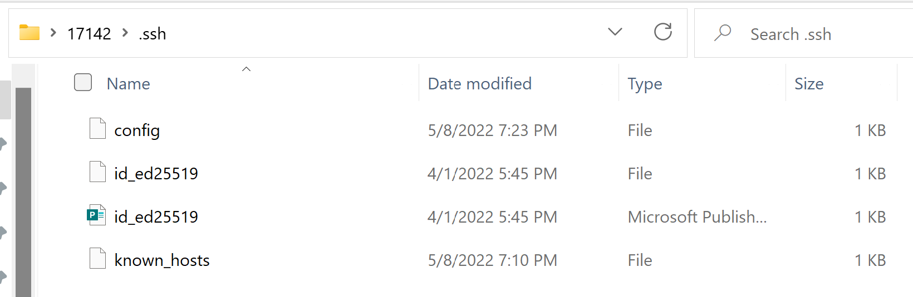

# Week 6 Lab Report

## 1. Streamlining ssh Configuration

In this part of the lab, I accessed the `.ssh/config` file on my own computer to change the username I need to input to log onto my given remote server. The phrase after **Host** represents the username, *yesoryes*, I would have to input after the `ssh` command. The fourth line of the file explicitly refers to my public key, so that I would not need to enter a password to log onto the remote server. In the terminal, I ran the command `ssh yesoryes` which used my previously generated public key to log me onto the **cs15lsp22ajk** remote server.

In this next screenshot, I used the `scp` command to copy over the *DELETEAFTER.txt* file over to the **cs15lsp22ajk** server. After logging onto the server using `ssh` and checking the files on the server with the `ls` commands, we can see that *DELETEAFTER.txt* was indeed copied over.

## 2. Setup Github Access from ieng6

In this part of the lab, I set up my public key so that I can commit and push changes straight from the terminal. The screenshot above shows the public key that I added to Github on browser.

In the screenshot above, the *id_ed25519* files hold my private/public keys each respectively on my own computer.

After logging onto my remote server account and navigating to the *SkillDemo* folder using the `ssh` and `cd` commands, I decided to create a new file called *newfile.md* to commit onto github. After using several `git` commands including `git push origin main`, I was able to successfully commit these changes without interacting with github, as seen in the [commit history](https://github.com/21KennethTran/SkillDemo/commit/e91bc9df43571f825d5d0a005e577132756f9e40).

## 3. Copy whole directories with `scp -r`

Now that I am remotely connected to this account, I can run several commands to look at what files the account currently has. Some of the ones I have tried in my screenshot are: `cd`, `ls -l`, `ls -a`, `ls -lat`. I also learned that `l` prints out the files in **long format**, `a` prints out **all** files, `t` prints out the files in order **by time**, and that any combination of those key letters after `ls` outputs all of their information.
