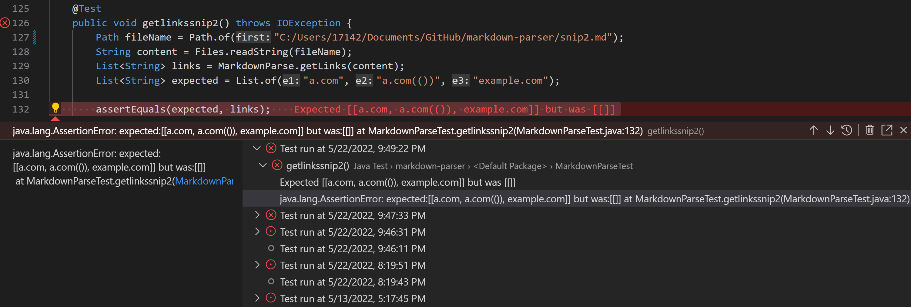
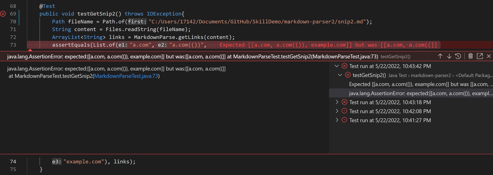

# Week 8 Lab Report

## 1. Snippet 1 Test and Implementation

In this part of the lab, I compared link results for 3 provided snippets between [our group's markdown-parser](https://github.com/21KennethTran/markdown-parser) and [group 7's markdown-parser](https://github.com/leahkuruvila/markdown-parser).

In the first snippet of code provided [here](https://github.com/21KennethTran/markdown-parser/blob/main/snip1.md), I created and ran a test on each repository's respective `MarkdownParseTest.java` files seen in the screenshots below:

As seen in the first screenshot, which was my lab group's chosen implementation of `MarkdownParse`, our actual outcome was nothing, while the expected outcome was supposed to include *'google.com, google.com, ucsd.edu*. The reason for this error was because of our logical implementation that would not count a link unless it had *https://*. If we were to remove this, we would have still not passed the JUnit test, since *url.com* would have counted as a link. I believe that we could implement a <10 line of code that would keep track of back ticks (`) in the md file, that would break the program if a second end back tick were inserted anywhere inside the link syntax.

In the second screenshot, I see a similar problem. This group, however, got all of the links, plus *url.com* in their program, so there would be less edits needed to implement code that would run the correct output. I would also add code that would break the program if a second back tick were inserted in the link syntax.

## 2. Snippet 2 Test and Implementation

In this second snippet of code, which could be found [here](https://github.com/21KennethTran/markdown-parser/blob/main/snip2.md), I created tests in both repository's `MarkdownParseTest.java` seen below:

In the first screenshot, which was my group's, we see the same problem as in the first snippet. The part of our code that only accepted links that had *https://* made it so all the links, *a.com, a.com(()), example.com* were not passed as outputs.

In the second screenshot, showing the other group's output, we see that it was *a.com, a.com((* was passed instead of the expected seen above. Both of our versions of `MarkdownParse.java` did not account for the link having closing parentheses. In both cases, I would implement some code that would scan the rest of the line, and stopping when there is a space inbetween the opening and closing parenthesis to include as part of the link. I would also do the same for the openning and closing brackets inclusive of spaces so that the *example.com* would be picked up.

## 3. Snippet 3 Test and Implementation

