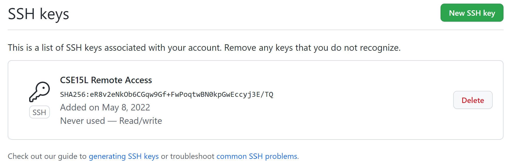

# Week 8 Lab Report

## 1. Snippet 1 Test and Implementation

In this part of the lab, I compared link results for 3 provided snippets between [our group's markdown-parser](https://github.com/21KennethTran/markdown-parser) and [group 7's markdown-parser](https://github.com/leahkuruvila/markdown-parser).

In the first snippet of code provided [here](https://github.com/21KennethTran/markdown-parser/blob/main/snip1.md), I created and ran a test on each repository's respective `MarkdownParseTest.java` files seen in the screenshots below:

As seen in the first screenshot, which was my lab group's chosen implementation of `MarkdownParse`, our actual outcome was nothing, while the expected outcome was supposed to include *'google.com, google.com, ucsd.edu*. The reason for this error was because of our logical implementation that would not count a link unless it had *https://*. If we were to remove this, we would have still not passed the JUnit test, since *url.com* would have counted as a link. I believe that we could implement a <10 line of code that would keep track of back ticks (`) in the md file, that would break the program if a second end back tick were inserted anywhere inside the link syntax.

In the second screenshot, I see a similar problem. This group, however, got all of the links, plus *url.com* in their program, so there would be less edits needed to implement code that would run the correct output. I would also add code that would break the program if a second back tick were inserted in the link syntax.

## 2. Snippet 2 Test and Implementation

In this part of the lab, I set up my public key so that I can commit and push changes straight from the terminal. The screenshot above shows the public key that I added to Github on browser.

In the screenshot above, the *id_ed25519* files hold my private/public keys each respectively on my own computer.

After logging onto my remote server account and navigating to the *SkillDemo* folder using the `ssh` and `cd` commands, I decided to create a new file called *newfile.md* to commit onto github. After using several `git` commands including `git push origin main`, I was able to successfully commit these changes without interacting with github, as seen in the [commit history](https://github.com/21KennethTran/SkillDemo/commit/e91bc9df43571f825d5d0a005e577132756f9e40).

## 3. Snippet 3 Test and Implementation

In this part of the lab, I attempted to copy over my `markdown-parser` directory over to the remote server. The first screenshot shows how running the `scp -r` along with the absolute path of my directory and file name of the directory in the remote server would copy over the contents of `markdown-parser` over to the new directory.

After logging onto the remote server using `ssh`, I ran the junit tests in this copy of `markdown-parser`, which successfully ran.

In this screenshot above, I successfully copied over `markdown-parser`, changed directories, compiled, and ran the junit tests all in one command. Specifically, the screenshot showcases the last files to be copied over and the successful tests. I was able to achieve this with the following line: `scp -r C:\Users\17142\Documents\GitHub\markdown-parser yesoryes:~/markdown-parse; ssh yesoryes 'cd markdown-parse ; /software/CSE/oracle-java-17/jdk-17.0.1/bin/javac -cp .:lib/junit-4.13.2.jar:lib/hamcrest-core-1.3.jar MarkdownParseTest.java ; /software/CSE/oracle-java-17/jdk-17.0.1/bin/java -cp .:lib/junit-4.13.2.jar:lib/hamcrest-core-1.3.jar org.junit.runner.JUnitCore MarkdownParseTest'`.