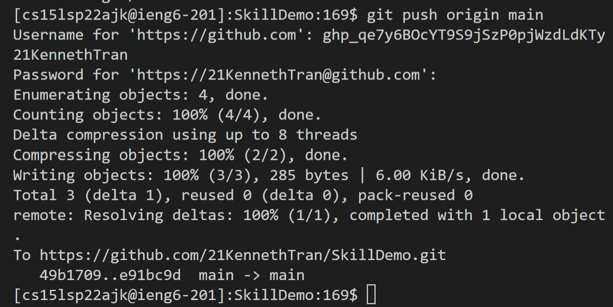

# Week 8 Lab Report

## 1. Snippet 1 Test and Implementation

In this part of the lab, I accessed the `.ssh/config` file on my own computer to change the username I need to input to log onto my given remote server. The phrase after **Host** represents the username, *yesoryes*, I would have to input after the `ssh` command. The fourth line of the file explicitly refers to my public key, so that I would not need to enter a password to log onto the remote server. In the terminal, I ran the command `ssh yesoryes` which used my previously generated public key to log me onto the **cs15lsp22ajk** remote server.

In this next screenshot, I used the `scp` command to copy over the *DELETEAFTER.txt* file over to the **cs15lsp22ajk** server. After logging onto the server using `ssh` and checking the files on the server with the `ls` commands, we can see that *DELETEAFTER.txt* was indeed copied over.

## 2. Snippet 2 Test and Implementation

In this part of the lab, I set up my public key so that I can commit and push changes straight from the terminal. The screenshot above shows the public key that I added to Github on browser.

In the screenshot above, the *id_ed25519* files hold my private/public keys each respectively on my own computer.

After logging onto my remote server account and navigating to the *SkillDemo* folder using the `ssh` and `cd` commands, I decided to create a new file called *newfile.md* to commit onto github. After using several `git` commands including `git push origin main`, I was able to successfully commit these changes without interacting with github, as seen in the [commit history](https://github.com/21KennethTran/SkillDemo/commit/e91bc9df43571f825d5d0a005e577132756f9e40).

## 3. Snippet 3 Test and Implementation

In this part of the lab, I attempted to copy over my `markdown-parser` directory over to the remote server. The first screenshot shows how running the `scp -r` along with the absolute path of my directory and file name of the directory in the remote server would copy over the contents of `markdown-parser` over to the new directory.

After logging onto the remote server using `ssh`, I ran the junit tests in this copy of `markdown-parser`, which successfully ran.

In this screenshot above, I successfully copied over `markdown-parser`, changed directories, compiled, and ran the junit tests all in one command. Specifically, the screenshot showcases the last files to be copied over and the successful tests. I was able to achieve this with the following line: `scp -r C:\Users\17142\Documents\GitHub\markdown-parser yesoryes:~/markdown-parse; ssh yesoryes 'cd markdown-parse ; /software/CSE/oracle-java-17/jdk-17.0.1/bin/javac -cp .:lib/junit-4.13.2.jar:lib/hamcrest-core-1.3.jar MarkdownParseTest.java ; /software/CSE/oracle-java-17/jdk-17.0.1/bin/java -cp .:lib/junit-4.13.2.jar:lib/hamcrest-core-1.3.jar org.junit.runner.JUnitCore MarkdownParseTest'`.