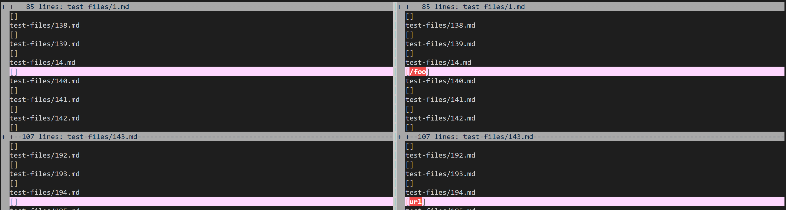
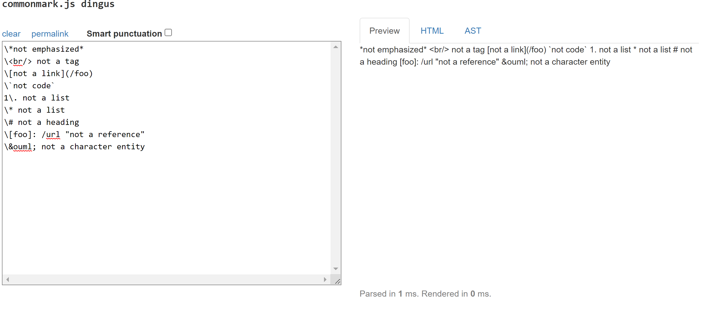
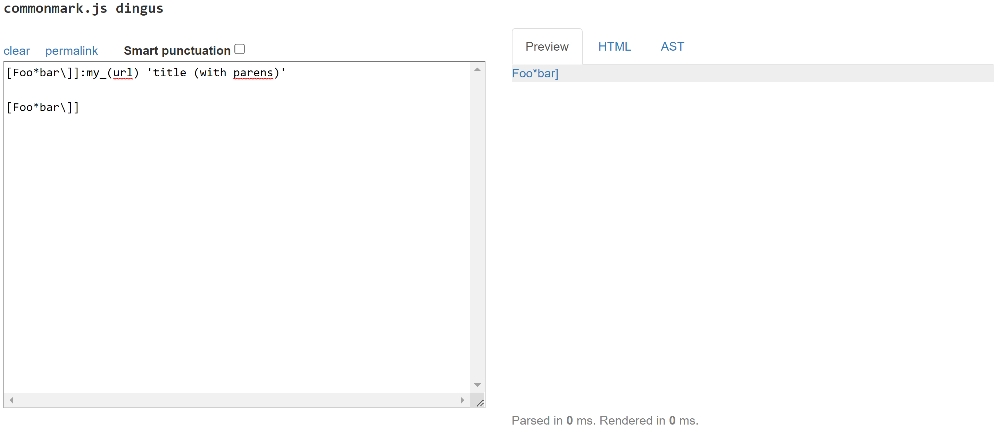

# Week 10 Lab Report

## 1. Comparing Test Results

In this part of the lab, I was given [my markdown-parser](https://github.com/21KennethTran/markdown-parser) and the following [markdown-parser implementation](https://github.com/nidhidhamnani/markdown-parser/blob/main/MarkdownParse.java), where I would have to compare results when the [test-file](https://github.com/nidhidhamnani/markdown-parser/tree/main/test-files) containing hundreds of test cases were inputted. On my `ieng6` account, I used the provided `script.sh` to run and save the results of testing those files on both implementations of markdown-parser. I then used `vimdiff` to compare the results, as seen in the screenshot below:

## 2. Comparing Results from File 14.md

This first result comparison in [14.md](https://github.com/nidhidhamnani/markdown-parser/blob/main/test-files/14.md) seen in the screenshot in the previous section shows that my `markdown-parse` outputted `[]` which means that it found no valid links, while the other `markdown-parse` outputted `[/foo]`, meaning that it caught */foo* as a link. However, when checking with the [CommonMark website](https://spec.commonmark.org/dingus/) here:

We see on the right that the preview does not highlight any links, meaning that no valid links should have passed in either case. My version of the program catches this, but not in the way that would eliminate all cases. In both implementations I would search for */* one index before a bracket or parenthesis, in which case I would not count that bracket/parenthesis as part of the link syntax.

## 3. Comparing Results from File 194.md

In this second comparison for [194.md](https://github.com/nidhidhamnani/markdown-parser/blob/main/test-files/14.md) seen in the screenshot in **Section 1**, my `markdown-parse` outputted `[]` which means that it found no valid links, while the other `markdown-parse` outputted `[url]` meaning that it caught *url* as a link. However, when checking with the [CommonMark website](https://spec.commonmark.org/dingus/) here:

We see that on the right, the preview highlights **Foo*bar]** as a possible link. Upon further inspection of what was given in the file, I found that the first line in Markdown defines the link, *my_(url)*, with the title **Foo*bar]** and tag, *title (with parens)*, while the following line displays that as a link.

In this case, both implementations are wrong. One way to fix this is to look for a colon (:) right after the close bracket and including everything between it and the next space to be a valid link. At the same time, the program should also keep whatever is in the brackets in memory, inclusive of the brackets, in order to keep track of how many times this link is displayed after its definition.